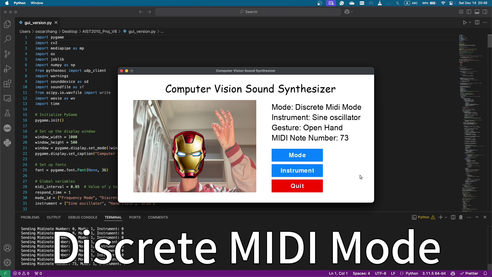

# Demo

***Click image above to watch full demonstration video***

# Guide for Using

### Running the program

1. Open `sound_syn.scd` in SuperCollider.
2. Boot the SuperCollider server, can use `ctrl/cmd + B`.
3. Evaluate file or session, can use `ctrl/cmd + enter`.
4. Open a terminal and navigate to the directory containing `RunMe.py`</mark>`.
5. Run the script.
6. Wait for a while until the pygame window finish initialization.

### Using the Program

- The program will start capturing video from your webcam.
- You will see the current mode, instrument, and frequency or MIDI note being displayed on the right hand side of the window.
- You may change the mode and instrument by clicking the corresponding buttons on the right.

### Modes

- **Frequency Mode**: The frequency of the sound is controlled by the vertical position of your hand's metacarpophalangeal (MCP) joint.
- **Discrete Midi Mode**: The MIDI note number is controlled by the vertical position of your hand's metacarpophalangeal (MCP) joint. Touch thumb and index fingers to play the sound. You can hold them to lengthen the sound's playing time.
- **Composing Mode**: Holding hand gesture "One" to start a recording. Release the hand gesture "One". The recording will be played repeadingly and further tracks can be added. Change to hand gesture "Fist" to release the buffers one by one, of last added recording being released first.

### Instruments

- Sine Oscillator
- Hand Flute
- Drum

### Controls

- Click `Mode` button to switch between Frequency mode, Discrete Midi mode, and Composing mode.
- Click `Instrument` button to switch between instruments.
- Touch thumb and middle thinger to reset the position for MIDI note calculation.
- Touch thumb and index finger to play the sound based on the detected gesture.
- Click `Quit` button to quit the program.

### Gestures

- `Fist`: Stops the sound.
- `Open Hand`: Plays a sound based on the current mode and hand position.
- `One`: Starts a recording in Track Overlay Mode.

### Example Usage

1. Start the program.
2. Click `Mode` button to switch to Discrete Midi Mode.
3. Touch thumb and middle finger to play the sound.
4. Click `Instrument` button to switch to Hand flute.
5. Make a fist to stop the sound.
6. Open your hand and move it up or down to change the MIDI note.
7. Touch thumb and index finger to play the sound.
8. Click `Quit` button to quit the program.
